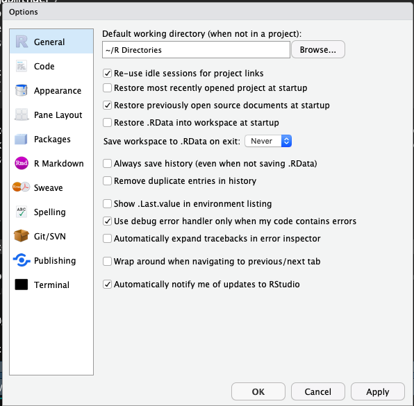

```{r options, include=FALSE}
htmltools::tagList(rmarkdown::html_dependency_font_awesome())
```


# Week 0

## Resources:

In case you have never worked with R up until this point, below is a guide to 
setting everything up. If you are ready, just use the navbar on the left to 
skip this.

## Downloading R and Rstudio.

1. Go to the UofT CRAN [website](http://cran.utstat.utoronto.ca/) and download
and install R for your Operating System.

2. Go to the Rstudio [website](https://www.rstudio.com/products/rstudio/download/#download) and
download and install it.

## Downloading important packages

Open Rstudio, and navigate to the console. Then run the following commands to get
the packages I highly recommend you get:

install.packages(c("gridExtra","MASS","ISLR","car","modelr","gapminder","broom","e1071","summarytools","tidyverse"))
You will need to replace the quotation marks if you copypaste this.

This will install all the packages we should need for the class. Whenever you want
to add a package you can either call the command:

install.packages(\<quoted package name\>)

or navigate to the Files and plots pane in Rstudio, click on packages, then 
install, and type in the name.

Note that you only need to do this once, and the packages will remain for any
R script you are writing.

## Learning

There is a number of resources available for you to learn and master the 
tidyverse package, which is what you will be using if you ever work with R.
It's technically not required for the course but it will make your life a lot easier.

[Learn R with tidyverse](http://r4ds.had.co.nz/) - this on it's own should 
give you good enough background to handle most of the coding you will ever do 
in R, both in class, and in a professional setting.

[Advanced R with tidyverse](https://adv-r.hadley.nz/) - most likely far beyond
the scope of what's needed for the course, but a great resource if you want 
to get involved with R.

[Cheatsheets](https://www.rstudio.com/resources/cheatsheets/) - very useful set
of cheatsheets that you should probably keep open whenever you are working with
tidyverse. (Especially the visiualization one)

Some other packages you should consider looking into, that will come handy 
during this class:

"car" - it is "the package" for regression models,
which are the main topic of this course.

"summarytools" - contains function "dfSummary" which is the fastest way to 
get meaningful first glance at the data. It's a good compromise between
the ease of using "summary" or "glance", and providing as much information
as possible.

"forcats" - package for working with factors in r, part of the tidyverse family
but not included in the tidyverse itself.

Just to cover all bases below I will show you the simple workflow that I follow
when working with a new dataset, like you will be doing multiple times throughout
the course:

## RStudio Setup and settings

If this is your first time using RStudio, you should adjust your settings:

* Navigate to Tools -> Global Options

* Change "Save workspace to .RData on exit" to Never

* Uncheck "Restore .RData into workspace at startup" 

This is what mine look like:



Now, every time you want to start working on something, you should begin
by creating an Rproject. This helps you keep track of the files, sets your 
working directory so that data loading is easier, and you should always do it.

Now that we have all that out of the way let's start with what to do once you 
have RStudio open and ready to work.

## File Setup

Since you will need to create pdfs from your code with figures and equations
you will be using the knitr package and will be working in .Rmd files. This 
is the most common way to write anything in R that isn't pure code. Make sure
you have some distribution of LaTeX downloaded as it is necessary to create 
the pdfs. I recommend MikTeX, but it shouldn't matter which one you have in 
this course.

When you create a new .Rmd file you will notice that at the top it will have
a header containing the file title, your name and date. If you want to add
a table of contents (which is created from headers) just change the
output line to look like this:


## Packages

At the start of each file you should also load ALL the packages you will be using.
Please don't scatter library calls throughout your file.

```{r library load, message=FALSE, warning=FALSE}

library(gridExtra)
library(MASS)
library(ISLR)
library(car)
library(modelr)
library(gapminder)
library(broom)
library(e1071)
library(summarytools)
library(tidyverse)

set.seed(217828)

```

## Loading Data

First let's see how we would load data from a downloaded ".csv" file:

The example dataset will be the one create for the Actuarial Students National
Association case competition technical challenge from this year. If you are 
interested in how the data was created you can check out the personal projects 
tab and find it under "ASNA Case Comp".

```{r loading data example}
# Load in the example.csv file that is in the working directory (this is assuming either the project
# was created or manual change of working directory happened before this line)

# Using Base reading (not advised)
data1 <- read.csv("training_data.csv")

# Using Tidyverse loading
data2 <- read_csv("training_data.csv")

# Load data specifying all possible options:
data3 <- read_csv(file = "training_data.csv", # file path relative to WD
				  col_names = TRUE, # Does the file include column names
				  na = c("", "NA", "N/A"), # What are the missing values in the file 
				  #(specified in a vector)
				  quoted_na = TRUE, # should missing values inside of quotes be missing
				  skip = 0, # How many lines to skip
				  n_max = Inf, # How many lines to read at most (Inf = infinity)
				  guess_max = 10000 # How many records to use to guess the type of column
				  # if not specified in col_types = c()
				  )

# This is to remove two of the redundant data files from my wd
df <- data3
rm(list = c("data1", "data2", "data3"))
```

In most cases you will want to specify at least some of the parameters from the cell above,
especially helpful is guess_max, and na. However in this course we will be
working mostly with nicely formatted data so it shouldn't be an issue.

## Analyzing Data

I will skip showing you base R way of analyzing data, I've never seen it used
outside of classes, and is neither easier nor faster. If you are really interested
and want to work in a field that has extremely harsh regulations regarding 
software (clinical trials maybe?), you can use the swirl package to learn doing it. 

```{r first glance at data}
# Take a first glance at the data:
dfSummary(df)
```

As you can see the summary provided by the dfSummary function is quite comprehensive.
You see the type, what percentage of values is valid (non-missing), the simple
summary (mean, median, sd, etc), a nice ASCII plot of the distribution(!!!) of data,
and the number of observations in the most common values. If you were to use base R
to get all of this, it would probably be around 5-6 lines of code per column of your data.

Now I will show you how to create a summary datasets using tidyverse and wrangle
the data in general. There are a few very important functions you should learn:

* *mutate* - create a column as a transformation of existing columns

* *select* - select a subset of columns

* *filter* - filter only rows fuliling the criteria

* *rename* - rename a column

* *group_by* - allows you to group your data based on a data column

* *summarize* - self explanatory

One more very important part of the tidyverse is the pipe operator %>%
which feeds the results of one function as the first argument to the next function.
It makes the code a lot more readable and allows you to write it in a better 
way since you don't go in to out but rather in order.

Below I will show you some examples of how I would create some potentially interesting
summaries of data:

```{r simple data analysis example with tidyverse}
summary1 <- df %>% # This line specifies the new dataset name, and starting data + pipe into
	dplyr::select(`Vehicle Size`, `Claim Class`, `Monthly Premium Auto`, Coverage, `Marital Status`) %>%
	# I select only the few columns of interest
	filter(`Monthly Premium Auto` > 65) %>% # I only want the people that have Auto premiums above
	# 65, this will usually come from the business or research question you are trying to answer
	group_by(`Vehicle Size`, Coverage, `Marital Status`) %>% # I want to summarize
	#them by the categorical variables
	summarise(mean_prem = mean(`Monthly Premium Auto`), # I want to have mean auto premium
			  count = n(), # Count of those vehicles
			  avg_sev = mean(`Claim Class`) # I want to have the average Claim Class (severity)
			  )
# Now I will take this created summary and analyze it further:

summary2 <- summary1 %>% 
	mutate(Total_Premium = mean_prem * count) %>% # I create the total premium from the group
	# as Average Premium * count of policies in that group
	filter(Total_Premium > 100000) # Filter out lines of business that are
	# under 100k in total premium

# This is the subset of data that might be of interest to me, let's look at it again:
dfSummary(summary2)

```

Normally at this point I would be making some simple graphs and reporting back
to the business what they wanted to know, or digging deeper for causes depeinding
on the communicated need. If this was part of my own project I would
try to investigate further why there are not that many large cars in our book
and why are the "Premium" coverages not a big part of our business.

To get started with the visualisation part, I will prepare some simple graphs 
from the newly obtained summary data. The main plotting function we will be using
is ggplot2 (as opposed to built in functions), the syntax is not very intuitive 
at first, and there are some kinks you will have to figure out, but ultimately
the combination of dplyr (tidyverse) data wrangling and analysis with ggplot2
makes for a very powerful and simple to use set of tools.

```{r basic graphs in ggplot2}

plot <- ggplot(data = summary2, # Create a plot object, from summary2
			   mapping = aes(x = `Vehicle Size`, # x axis is Vehicle Size
							y = `Total_Premium`, # y axis is Total Premium
							fill = Coverage)) + # The inside of the figures is colored by coverage
	geom_col(show.legend = TRUE) + # Add a column plot (barplot is for frequencies in ggplot2)
	coord_flip() + # Flip the chart to be sideways
	theme_minimal() + # Set the minimal theme
	labs(title = "Simple plotting illustration", # Add title
		 x = "Vehicle Size", # Rename X axis
		 y = "Total Premium($)") # Rename Y axis 

plot # Show the plot

```

